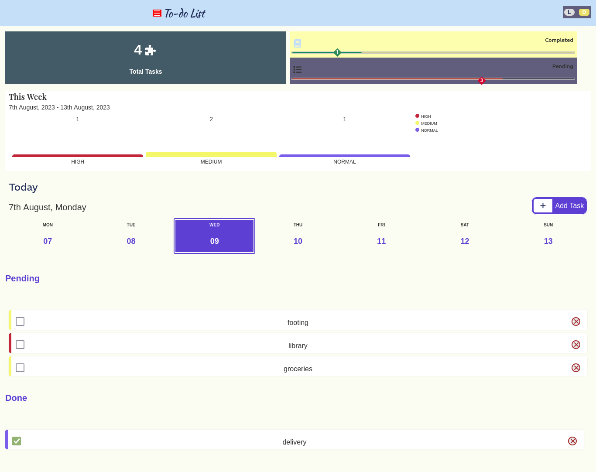

# To Do List

Sideland : **## To Do List**

> ### Overview :

- Schedule your week with this small application.

## Interest

You might be interested on how:

- **re-render** the DOM using vanilla javascript
- **format** Date using library **moment.js**

### Links

- Solution URL: [https://github.com/BeinRain06/To-Do-List.git](https://github.com/BeinRain06/To-Do-List.git)
- Live Site URL: [https://beinrain06.github.io/To-Do-List/](https://beinrain06.github.io/To-Do-List/)

## Description : \* challenge issue

**list Tasks EventListener**

My big Deal was to properly render **list Tasks** of each day of the week in the DOM.

I made several move , i got one harsh issue doing when **creating element**, **fill the innerHTML of the element** m and then after try to add an **EventListener** for one or several elements set as `innerHTML`. It doesn"t work. You can see what i did:

> `
> const taskIn = document.createElement("li");

        taskIn.id = item.id;
        taskIn.setAttribute("data-priority", item.priority);
        taskIn.className = `task_match_content ${
          taskIn.checked ? "done" : ""
        taskIn.innerHTML = ` 

        <input
          type="checkbox"
          name="${item.title}"
          id="${item.id}"
          class="input_check"
          checked="false"
        />
        <label for="${item.id}">item.title</label>
      

      <button class="remove_task"><i class="fa-solid fa-xmark"></i></button>`
      taskInputCheckbox = document.querySelector(`#${item.id}.circle_match`);`;

taskInputCheckbox = document.querySelector(`#${item.id}.circle_match`);`

> the last line! grabbing `taskInputChecbox` doesn't **work**
>
> **Why ?**
>
> simply said the response lay to the fact that we **try to access** something that javascript has created and done with it ! this **input checkbox**, javascript doesn't longer deal with that because it not a laying **part** of DOM (_a tag_ inside our **index.html** but a **flying html** writed in javascript). That makes **difficult** and wuite **impossible** to access element that are part of the past doing the kind of stuff seen above
>
> **solution**
>
> We find it is better to **create** each element separately and those who need **EventListeners** will be assign right after filling their attribute html. Like this underneath:
>
> `const taskIn = document.createElement("li");

        taskIn.id = item.id;
        taskIn.setAttribute("data-priority", item.priority);
        taskIn.className = `task_match_content ${
          taskIn.checked ? "done" : ""
        } `;

        //adding checkbox
        const check = document.createElement("input");
        check.className = "circle_match";
        check.type = "checkbox";
        check.id = item.id;
        check.checked = item.checked;
        taskIn.appendChild(check);

        check.addEventListener("change", () => {
          item.checked = !item.checked;

          console.log("profilerList", profilerList);

          Storage.tasksAchieveIn(profilerList);

          profiler._render();
          chart._renderChart();
          this._renderList(profiler, chart, moment(item.date).format("MMM D"));
          this._noTasks();
        });`

- Here our button with the name of `check` have an **EventListener** and triggering **this button** has effect and **non issue**

**Empty Day Tasks rendering**
Well I made a big Function in **ListTemplate.js** the core function of th file called **\_renderList()** that takes inside **03 parameters** and the duty is to **first** `render tasks` the current date, **second** `update` **totalTasks** in listTasks and after also update and render all the part affected to `chart flow` and siblings family **progressbar** and others.

Then i made the function but have trouble to figure out how to barely display :

> **0 Completed Tasks** > **0 Pending Tasks**
> For **Day** having **no tasks** scheduled.

This is what i made before:

> ` \_renderList(profiler, chart, dateValue) {

    const profilerList = profiler._listTasks;

    this._clear();

    profilerList.map((item, index) => {
      const itemDate = moment(item.date).format("MMM D");

      if (itemDate === dateValue) {
        const taskIn = document.createElement("li");
        taskIn.id = item.id;
        taskIn.setAttribute("data-priority", item.priority);
        taskIn.className = `task_match_content ${
          taskIn.checked ? "done" : ""
        } `;

        check.addEventListener("change", () => {
          item.checked = !item.checked;

          console.log("profilerList", profilerList);

          Storage.tasksAchieveIn(profilerList);

          profiler._render();
          chart._renderChart();
          this._renderList(profiler, chart, moment(item.date).format("MMM D"));
          this._noTasks();
        });

        ...

      } else {
        this._noTasks();
      }
    });

}`

but **i have to do so** :

> ` \_renderList(profiler, chart, dateValue) {

    const profilerList = profiler._listTasks;

    this._clear();

    profilerList.map((item, index) => {
      const itemDate = moment(item.date).format("MMM D");

      if (itemDate === dateValue) {
        const taskIn = document.createElement("li");
        taskIn.id = item.id;
        taskIn.setAttribute("data-priority", item.priority);
        taskIn.className = `task_match_content ${
          taskIn.checked ? "done" : ""
        } `;

        check.addEventListener("change", () => {
          item.checked = !item.checked;

          console.log("profilerList", profilerList);

          Storage.tasksAchieveIn(profilerList);

          profiler._render();
          chart._renderChart();
          this._renderList(profiler, chart, moment(item.date).format("MMM D"));
          this._noTasks();
        });

        ...

      }
    });
    this._noTasks();

}`

> Notice the position of the called inside function `this._noTasks()` in the first draw code the last instance of `this._noTasks()` are inside the loop and in the DOM they unexpected rendering also the message inside **this.\_noTask()** when a date **day** has to display their content **items lists** instead of doing what **work** the second draw code where apply innerHTML to the **empty days** changes **correctly** even when these days sre **filled** with **scheduled tasks**;
>
> Notice in the second draw code the last instance of is outside of the loop and **close** the actions of `_renderList()` method;

> i have to use insted `percentage` and style **width** property rather than _backgrounnd_
>
> I obtain a result doing like :
> ` document.getElementById(`calorie-progress`).style.width= `${width}`%`

**square containing pending and completed tasks**

Minimal but also optimal for me i haven't use **setProperty** for a while and i se myself drozn in confusion.
I finally set my variables :

- **--progress-bar-pending**
- **--progress-bar-completed**
  in the `:root` document (style.css)

and manage to properly move these square using the two linescode below:

> ` document

      .querySelector(":root")
      .style.setProperty("--progress-bar-pending", leftSquare + "%");

    document
      .querySelector(":root")
      .style.setProperty("--progress-bar-completed", leftSquare + "%");`

**Picture**

---

---

# What I learned

### First time using webpack

i learn basic configuration with `webpack` **frontend environment**. How to use **web.confg.js** file to set parameters as :

- **loaders** (css-loader, style-loaders)
- add **plugin** to use extra features of webpack ( mini-css-extract-plugin, html-webpack-plugin)
- configure the **scripts** for the **development mode** and the **production mode**
- set **webpack live development server**

### render with vanilla Javascript

Vanilla doesn't barely work like **react js** who re-render itself after using **compenentDidMount**, **componentDidUpdate** or **Hooks** .

> In Vanilla because we don't sustain in library to render we have to notify or write **ourself** method that **re-render** the DOM.
> In our Project every method with the prefix **render** or the prefix **display** have this duty **re-render the DOM** .

Another way to do is use method **getter** or **setter** method javascript , we don't implement our coding to use it but it is an option and one great also.

You can see in our project everywhere we performed render how the flow code was going.

### moment js to format date

To use moment we need first to install the packasge using **npm**,

> `import moment from "moment"` in the file desired (eg: _TasKProfiler.js_)
>
> then you can **format** Date writing like this;
>
> **current date : `const currentDate= moment().format("MMM D")` > **6 days after current date : `const week= moment().add(6, "days").format("MMM D")`
> Date inside an on object called **item** withh property **date** inside :
> `const selectedDate= moment(item.**date**).format("MMM D")`
>
> here for the example we used format("MMM D"). There are many others formatting like :

> format("DD")
> format("YYYY-MM-DD")
> format("Mo D")
> etc

It all depend of how you want to present your date . Moment doesn't care too much either r not the calendar rendered will look good . But take care of **formatting** date in many template.

You might want to look through **moment documentation** for more **format exa;ple**.

### Mobile Responsiveness

    - Mobile reponsiveness for mobile min-width: 226px

**Picture**

---

---

## Callback History:

- **Schedule Your Week** enhance the power to have things done right at the time. Be consisten, efficient and begin to run fast, and to stand out of the average. All that by scheduling all your weeks thhourougly. That is how you can achieve a lot and become a **makers** not just **followers**

> **The Power is Yours**

> Remember, **\*Mark Twain** said :
> The two important day of your life is, the day you _were born_ and the day **_you discovered why_**.

## Useful Resources :

- Ritika Agrawal811[github] : [https://github.com/Ritika-Agrawal811/to-do-list](https://github.com/Ritika-Agrawal811/to-do-list) : All this project is based upon this one i'm humble and say you greatly Thanks you **RitiKa**.

## Acknowledge:

This project always remember the Team :

-**Ritika Agrawal811**: vanilla javascript course on udemy, well explain our game

-**W3Schools Team** a reminder on css and javascript

-**MDN Mozilla reference TTeam** a reminder on css and javascript

- **StackOverFlow** Resources help a lot when bumping into errors. Thanks you to the **Team** newer or older .

_Our Work always remember this team_

- `Ritika Agrawal811` for her beatiful **to-do-list** project;
  >
- And all the Teams Mozilla MDN Reference, StackOverFlow, and W3Schools.

## Author

- Frontend Mentor - [https://www.frontendmentor.io/profile/BeinRain06](https://www.frontendmentor.io/profile/BeinRain06)
- Twitter - [https://twitter.com/nest_Ngoueni](https://twitter.com/nest_Ngoueni)
